  

<h1 align="center">진현진</h1>

  Frontend Developer

 

## About Me

- 사용자 흐름에서 느껴지는 작은 어색함을 발견하고 자연스럽게 다듬습니다.
- 로딩, 에러, 빈 상태까지 화면 경험의 일부로 보고 구현합니다.

 

## Tech Stack

### Frontend

  
  
  
  
  
  
  
  

### Tools

  
  
  
  
  
  
  

### Collaboration

  
  
  

 

## Repositories

<table>
  <tr>
    <td width="33%">
      Team Project
       
      <a href="https://github.com/Oz-union-16-Team-1/oz_union_16_FE">
        <strong>PGTI Frontend</strong>
      </a>
       
      게임 취향 설문, 추천 리스트, 장르별 매칭 화면을 함께 만든 팀 프로젝트입니다.
    </td>
    <td width="33%">
      Remaster
       
      <a href="https://github.com/hj-devlog/oz_16_react_mini">
        <strong>OZ Movie Remaster</strong>
      </a>
       
      TMDB API 기반 영화 검색 프로젝트를 다시 정리하고 Vercel로 배포했습니다.
    </td>
    <td width="33%">
      Practice
       
      <a href="https://github.com/hj-devlog/react-practice">
        <strong>React Practice</strong>
      </a>
       
      React와 Vite 기반 화면 구현을 연습한 개인 실습 레포지토리입니다.
    </td>
  </tr>
</table>
